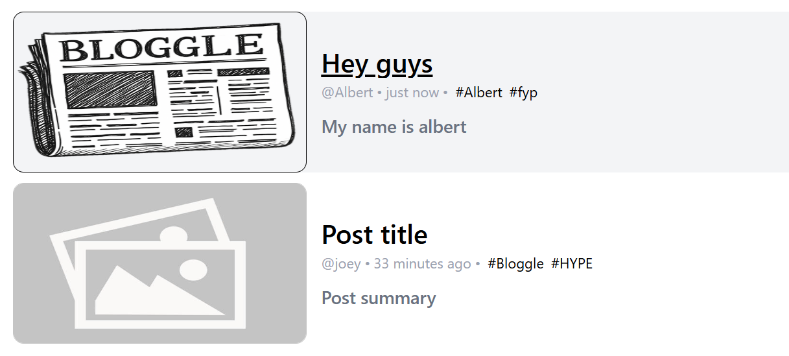

<h1 align="center" id="title">Bloggle v1.4.2</h1>

<p align="center">
  
</p>

<p id="description">
  Bloggle is a news-based app where users can write their own posts, manage them easily, and discover other content shared by others. 
  Built w/react,tailwind,typescript and using various API's for it to work including google,guardian and mongoDB
</p>

<h2 align="center">Visit here</h2>

<div align="center">
  <a href="https://bloggleapp.onrender.com">BloggleApp.onrender.com</a>
</div>

<h2 align="center">🧐 Features</h2>

<h4>Here're some of the project's best features</h4>

*   Create an account and login for experiencing all of its features
*   Functionality for editing and deleting posts made by you on Bloggle
*   Only on Bloggle page: posts made by users who made an account exclusively on bloggle
*   Trusted Sources page: official news coming from a news API to check out updates about what's happening around the world.
*   Has an API content moderation system using AI that checks posts for offensive content
*   And explore many other website mechanics and features by trying it on your own 

<h2 align="center">Snippets of code</h2><br/>

```javascript
// ...
// Bloggle's codebase HTML main tree:

createRoot(document.getElementById('root')!).render(
  <BrowserRouter>
  <UserContextProvider>
        <Routes>
      <Route path='/' element={<DefLayout/>}>
        <Route path='/' element={<FooterLayout/>}>
          <Route path='/' element={<CategoryLayout/>}>
                <Route path='/' element={<Articles/>}/>
                <Route path='/trustedPosts' element={<OfficialArticles/>}/>
              <Route path='/terms' element={<TermsOfUsePage/>}/>
              <Route path='/post/:id' element={<PostPage/>}/>
          </Route>
      </Route>
        <Route path='/login' element={<LoginPage/>}/>
        <Route path='/register' element={<RegisterPage/>}/>
        <Route path='/create' element={<CreatePost/>}/>
        <Route path='/edit/:id' element={<EditPost/>}/>
    </Route>
  </Routes>
  </UserContextProvider>
  </BrowserRouter>
)


// ...
```
<hr/>

```javascript
// ...
//  Snippet of backend code when connecting routes with imported functions

app.post('/register', async (req, res) => RegisterPost(req,res))
app.post('/login', async (req, res) => LoginPost(req,res))
app.post('/logout', (req,res)=>{res.cookie('token', '').json('ok')})

app.post('/post', uploadMiddleware.single('file'), async (req, res) => PostPost(req,res));
app.put('/post', uploadMiddleware.single('file'), async (req,res)=> PutPost(req,res))
app.get('/post/:id', async(req,res)=> GetPostId(req,res))
app.delete('/delete/:id', (req, res) => DeletePostById(req,res))

app.post('/post/:id/like', async (req, res) => PostLikeId(req,res))

// ...
```
<h2 align="center">Project Screenshots:</h2>
<div align="center">

  <hr/>
  <hr/>
  <hr/>

</div>

  ## 🪪 License
This project is licensed under the [MIT License](LICENSE).

</div><br></br>

[](https://www.gigicodeace.com)
[](https://www.linkedin.com/in/dobre-robert-03653b331/)
[](https://github.com/GIGI-CodeAce)
[](https://cssbattle.dev/player/gigi)

  <b></b>
   <h4>~GIGI <code>Dore Robert</code></h4>
</footer>